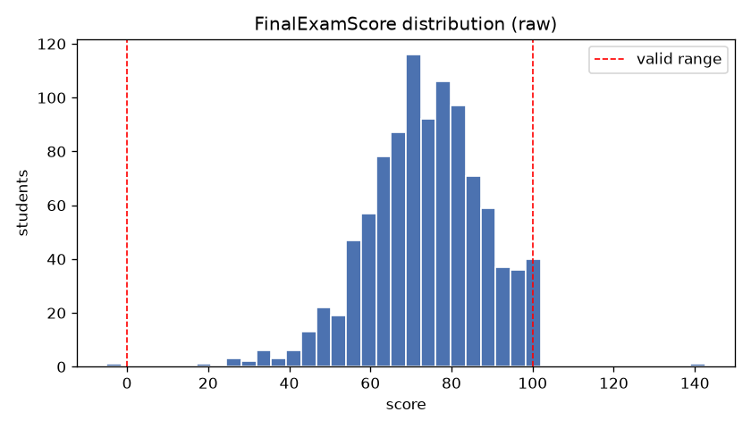
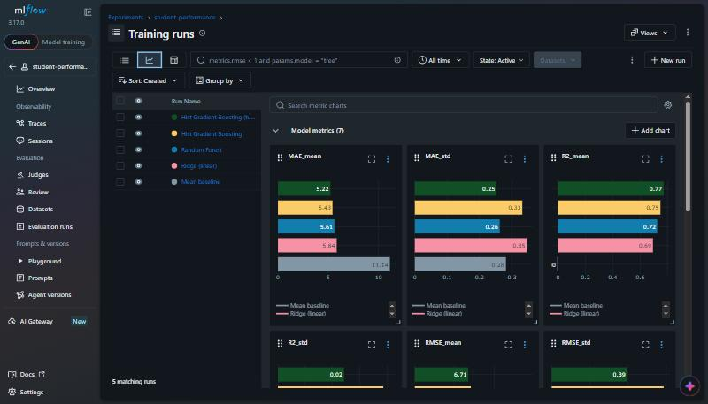
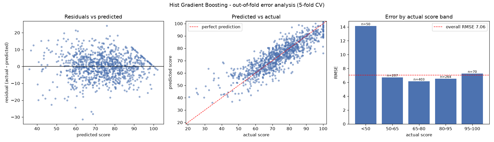
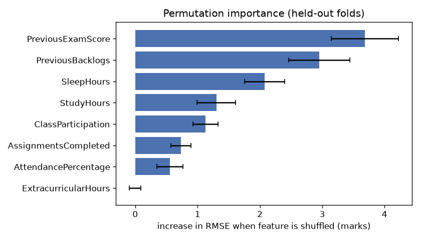

# Student Performance Prediction: Report

**Task:** regression. Predict `FinalExamScore` (0–100) from information available **before** the exam.
**Final model:** tuned `HistGradientBoostingRegressor` inside a scikit-learn `Pipeline` / `ColumnTransformer`.
**Result:** nested 5-fold CV **RMSE 6.71 ± 0.39** marks (MAE 5.22, R² 0.77), versus 14.04 for a mean baseline.
Every prediction comes with a **90% prediction interval** (92% coverage in CV).

**Video walkthrough:** _add link here_
**Live demo (Streamlit Community Cloud):** [https://student-score-predictor11.streamlit.app/](https://student-score-predictor11.streamlit.app/)

---

## 1. Methodology & Technical Summary

1. **Audit** the raw data for shape, missing values, impossible values, duplicates, target distribution and leakage (`src/audit.py`).
2. **Select features** by asking, for each column, *"would this be known before the exam?"* One column (`PostExamConfidence`) fails that test and is dropped (`src/features.py`). Its effect is quantified in `src/leakage_check.py`.
3. **Clean training rows** using fixed rules only: drop the 2 rows with an impossible target and 4 exact duplicates. No statistics are computed, so this cannot leak.
4. **Preprocess inside the pipeline.** Impossible feature values become `NaN`, then median imputation, then scaling (for the linear model only). Because this lives inside the `Pipeline`, it is re-fitted on the training folds of every CV split.
5. **Compare 4 model families plus a tuned variant** with 5-fold shuffled `KFold` (seed 42), reporting RMSE / MAE / R² as mean ± std. Tuning uses **nested CV** so its score stays honest (`src/train.py`). Every run is logged to **MLflow**.
6. **Refit the best model** on all 994 clean rows and save it to `models/pipeline.joblib`.
7. **Error analysis** on out-of-fold predictions, broken down by segment (`src/error_analysis.py`).
8. **Interpretation** with permutation importance on held-out folds (`src/importance.py`).
9. **Uncertainty** with conformalized quantile regression for 90% intervals (`src/intervals.py`).
10. **Package** the model as a CLI (`predict.py`) and a Streamlit demo (`app.py`). `submission.csv` is produced by the CLI.

**Stack:** Python 3.12, pandas, NumPy, scikit-learn 1.9, matplotlib, joblib, Streamlit, plus MLflow for tracking (exact pins in `requirements.txt` / `requirements-dev.txt`).

---

## 2. Data Audit

Source: `python src/audit.py`. Figures are in `reports/figures/`.

| Check | Training set (`student_performance.csv`) | Test set |
|---|---|---|
| Shape | 1,000 rows × 11 columns (ID, 9 inputs, target) | 200 rows × 10 columns (no target) |
| Data types | All numeric | All numeric |
| Missing values | 0.7–5.8% per input column; ID and target complete | 0–9 values per column |
| Duplicate IDs | 0 | 0 |
| Duplicate rows (ignoring ID) | **4** | – |
| Impossible target values | **2** (−5.0 and 142.5) | – |

**Bad records.** Each column was checked against a valid range defined in `src/config.py`:

| Column | Valid range | Impossible values found (train) | (test) |
|---|---|---|---|
| StudyHours (per day) | 0–16 | −1, 25 | **99** |
| AttendancePercentage | 0–100 | −1, 105, 112 | 105 |
| PreviousExamScore | 0–100 | 150 | – |
| AssignmentsCompleted (%) | 0–100 | −1, 140 | – |
| SleepHours (per night) | 2–14 | 0, 25 | −1 |
| PreviousBacklogs | 0–20 | −1 | – |
| FinalExamScore (target) | 0–100 | −5, 142.5 | – |

**Target distribution.** Mean 73.7, median 73.8, std 14.4. The distribution is roughly bell-shaped with a hard **ceiling at 100**: 33 students scored exactly 100.



**Correlation with the target** (Pearson, valid rows):

| Feature | r |
|---|---|
| **PostExamConfidence** | **+0.64** (highest; see leakage below) |
| PreviousExamScore | +0.60 |
| ClassParticipation | +0.43 |
| AssignmentsCompleted | +0.36 |
| AttendancePercentage | +0.30 |
| StudyHours | +0.27 |
| SleepHours | +0.07 (but strongly non-linear, see §7) |
| ExtracurricularHours | −0.00 |
| PreviousBacklogs | −0.63 |

**How each problem is handled:**

| Problem | Handling | Where |
|---|---|---|
| Impossible **feature** values | Set to `NaN`, then imputed | Inside the pipeline (`OutOfRangeToNaN`), so it also applies to test data and the demo |
| Missing feature values | Median imputation | Inside the pipeline, fitted on training folds only |
| Impossible **target** values | Row dropped (nothing valid to learn from) | `load_training_data()` |
| Duplicate rows | Dropped, so a copy can't sit in both a training and a validation fold | `load_training_data()` |

---

## 3. Feature Justification & Leakage

The test for every column: **could this realistically be known before the final exam?**

| Feature | Decision | Justification |
|---|---|---|
| ID | Drop | Row identifier, no information about the student |
| StudyHours | Keep | Study habit during the term |
| AttendancePercentage | Keep | Recorded throughout the term |
| PreviousExamScore | Keep | Earlier exam result, already known |
| AssignmentsCompleted | Keep | Coursework submitted during the term |
| SleepHours | Keep | Lifestyle habit, can be surveyed beforehand |
| ExtracurricularHours | Keep | Known beforehand. Weak signal but harmless |
| ClassParticipation | Keep | Instructor rating given during the term |
| PreviousBacklogs | Keep | Academic record of earlier failed courses |
| **PostExamConfidence** | **Drop: leakage** | Collected **after** the exam, so it reflects how the exam went. It does not exist at prediction time |

**Evidence of leakage** (`python src/leakage_check.py`, same CV and default gradient boosting):

| Feature set | CV RMSE |
|---|---|
| 8 pre-exam features (used) | 7.03 ± 0.59 |
| + PostExamConfidence (leaky) | 6.71 ± 0.58 |

The leaky column has the *highest* correlation with the target and would make the model look about 5% better. That score is unattainable in real use, so the column is excluded. Tuning (§5) reached the same RMSE **without** cheating.

---

## 4. Pipeline Design

```
Pipeline
├── prep: ColumnTransformer
│     └── num  (8 pre-exam features)
│           1. OutOfRangeToNaN   impossible values → NaN       (fixed rules, learns nothing)
│           2. SimpleImputer     median                        (learned from training folds)
│           3. StandardScaler    linear/baseline models only   (learned from training folds)
│     remainder="drop"           ID and PostExamConfidence never reach the model
└── model: regressor
```

**Leakage prevention:**
- Every model is evaluated as the *whole* pipeline with `cross_validate`, so imputer medians and scaler statistics are recomputed inside each training fold. The validation fold is never seen during fitting.
- The tuned model is a `RandomizedSearchCV` wrapped around the pipeline. Evaluating it with `cross_validate` gives **nested CV**: the search only ever sees the outer training fold.
- The only steps outside the pipeline are the target/duplicate row filters, which use fixed rules and no statistics.
- `random_state=42` is used everywhere for reproducibility.

---

## 5. Model Comparison & Hyperparameter Tuning

**CV strategy:** 5-fold `KFold(shuffle=True, random_state=42)` on 994 rows.
**Primary metric:** RMSE in exam marks (lower is better). MAE and R² are also reported.
Source: `python src/train.py` → `reports/cv_results.md`.

| Model | RMSE (mean ± std) | MAE (mean ± std) | R² (mean ± std) |
|---|---|---|---|
| **Hist Gradient Boosting (tuned, nested CV)** | **6.71 ± 0.39** | **5.22 ± 0.25** | **0.771 ± 0.024** |
| Hist Gradient Boosting (default) | 7.03 ± 0.59 | 5.43 ± 0.33 | 0.747 ± 0.039 |
| Random Forest (300 trees, min_samples_leaf=2) | 7.36 ± 0.43 | 5.61 ± 0.26 | 0.724 ± 0.026 |
| Ridge (linear, α=1) | 7.76 ± 0.54 | 5.84 ± 0.35 | 0.692 ± 0.041 |
| Mean baseline (`DummyRegressor`) | 14.04 ± 0.30 | 11.14 ± 0.28 | −0.003 ± 0.004 |

**Tuning setup and compute budget:**

| | |
|---|---|
| Method | `RandomizedSearchCV` on the gradient-boosting pipeline, scored by RMSE |
| Search space | learning_rate 0.01–0.3 (log), max_iter 100–600, max_leaf_nodes 8–64, max_depth {None, 3, 5, 8}, min_samples_leaf 5–60, l2_regularization 0.001–10 (log) |
| Budget | 30 random settings × 3 inner folds × 5 outer folds = **450 fits** for the nested estimate, plus 90 fits for the final search on all data |
| Hardware / time | 4 CPU threads (laptop, no GPU); about **70 s** for the nested CV |
| Best settings (final search) | learning_rate 0.024, max_iter 487, max_leaf_nodes 9, max_depth 8, min_samples_leaf 10, l2_regularization 4.34 (`reports/best_params.json`) |

**Interpretation:**
- **Baseline:** every real model roughly halves the error of always guessing the class average.
- **Linear vs trees:** Ridge already explains about 69% of the variance. Tree ensembles do better because of non-linear effects (e.g. sleep, §7).
- **Default models:** gradient boosting and random forest are within one standard deviation of each other.
- **Tuning:** a slower learning rate, small trees (9 leaves) and stronger regularization improved RMSE by 0.32 **and** made it more stable across folds (std 0.59 → 0.39). The tuned model is the final model.

**Experiment tracking.** Each comparison run (parameters plus RMSE/MAE/R² mean and std, and CV time) is logged to a local **MLflow** store (`mlflow.db`). View it with `mlflow ui --backend-store-uri sqlite:///mlflow.db`.



---

## 6. Error Analysis

Source: `python src/error_analysis.py`. It uses **out-of-fold** predictions from the tuned model: each student is predicted by a model that never saw them. Overall out-of-fold RMSE is 6.72.



**Error by actual score band.** Bias = mean(actual − predicted). Negative bias means the model predicts too high.

| Actual score | n | RMSE | MAE | Bias |
|---|---|---|---|---|
| **< 50** | 50 | **13.02** | 11.05 | **−10.03** |
| 50–65 | 207 | 6.66 | 5.41 | −2.98 |
| 65–80 | 403 | 5.90 | 4.77 | −0.20 |
| 80–95 | 264 | 5.93 | 4.53 | +2.72 |
| 95–100 | 70 | 7.47 | 5.69 | +5.57 |

**Weak segment: students who score below 50.** Their error is **about twice the average**, and the model over-predicts them by about **10 marks**.

**Why it happens:**
1. **Few examples.** Only 5% of training rows are below 50. Tree models predict averages of similar training students, so extreme outcomes are pulled toward the mean (regression to the mean). The same effect in reverse explains the under-prediction of top scorers (+5.6 bias).
2. **The cause isn't in the features.** Student 100319 had a previous exam score of 82, 86% attendance and 1 backlog. On paper this is an average student, predicted at 60.0, who actually scored 32.2. Illness, exam-day stress or personal circumstances are not captured by any column.
3. **Why it matters.** Low scorers are exactly the students an early-warning system should catch, and the model is least reliable for them. The prediction intervals (§8) are also least reliable here.

**Other segments:**

| Segment | RMSE | Comment |
|---|---|---|
| 0 previous backlogs (n=466) | 5.88 | Most predictable group |
| 3+ previous backlogs (n=88) | 8.82 | Higher variance in outcomes, fewer examples |
| Rows with clean inputs (n=759) | 6.32 | |
| Rows with a missing or invalid input (n=235) | 7.86 | Imputed medians lose information |

**Ceiling effect.** 33 students scored exactly 100. This creates the diagonal band in the residual plot (residual = 100 − prediction). Two out-of-fold predictions exceeded 100 (max 101.6), so `predict.py` and the demo **clip predictions to [0, 100]**.

**Possible improvements:** sample weighting or a quantile/Huber loss for the tail, extra features (e.g. mid-term marks, wellbeing indicators), and collecting more data on struggling students.

---

## 7. Feature Importance (Permutation)

Source: `python src/importance.py`. For each CV fold, the final pipeline is fitted on the training part. Then one feature at a time is shuffled **in the held-out part** (10 repeats) and the increase in RMSE is recorded. That makes 50 measurements per feature.



| Feature | RMSE increase when shuffled (mean ± std) |
|---|---|
| PreviousExamScore | 3.68 ± 0.54 |
| PreviousBacklogs | 2.95 ± 0.49 |
| SleepHours | 2.08 ± 0.32 |
| StudyHours | 1.30 ± 0.31 |
| ClassParticipation | 1.13 ± 0.20 |
| AssignmentsCompleted | 0.73 ± 0.16 |
| AttendancePercentage | 0.56 ± 0.21 |
| ExtracurricularHours | 0.00 ± 0.09 |

**Interpretation:**
- **Past performance dominates.** Previous exam score and previous backlogs are the two strongest signals.
- **Sleep is a hidden non-linear effect.** Its linear correlation is only 0.07, yet it is the 3rd most important feature. Average scores by sleep band show an **inverted U**:

  | Sleep (h) | ≤5 | 5–6 | 6–6.5 | 6.5–7 | 7–7.5 | 7.5–8 | 8–9 | >9 |
  |---|---|---|---|---|---|---|---|---|
  | Mean score | 59.2 | 68.6 | 72.8 | 75.6 | 76.4 | 76.9 | 72.0 | 63.6 |

  Both too little and too much sleep go with lower scores. A straight line can't capture this, which helps explain why trees beat Ridge.
- **Extracurricular hours** contribute nothing. The model is not hurt by them, and they could be dropped.
- These are associations within this dataset, **not causal effects**.

---

## 8. Prediction Intervals (Uncertainty)

Source: `python src/intervals.py`. Method: **conformalized quantile regression (CQR)**.
1. Two extra gradient-boosting pipelines (same preprocessing and tuned settings) predict the 5th and 95th percentile instead of the mean.
2. Raw quantile models are usually over-confident, so the interval is widened by a **calibration margin**. On inner-CV out-of-fold predictions, measure how far the true score falls outside [lower, upper] and take the 90% quantile of that distance.
3. Coverage is checked on the outer 5-fold CV. The margin is learned inside each outer training fold only.

| Interval | Out-of-fold coverage (target 90%) | Average width |
|---|---|---|
| Raw quantile regression | 78.4%, over-confident | 19.4 marks |
| **Conformalized (used)** | **92.0%** | 27.0 marks |
| … for students scoring < 50 | 52.0% | |
| … for students scoring ≥ 50 | 94.1% | |

The intervals are reliable overall but **fail for the same weak segment** found in §6. A wide-but-safe-looking interval can still miss a struggling student. The demo shows the interval for every prediction, and `predict.py --intervals FILE` writes them to a separate file (`reports/test_intervals.csv` for the test set), so `submission.csv` keeps the strict format.

---

## 9. Packaged Inference & Demo

**Artifacts:**
- `models/pipeline.joblib`: the fitted pipeline, feature list, CV score and scikit-learn version.
- `models/interval_models.joblib`: the quantile models and conformal margin.

**CLI:**
```bash
python predict.py --input data/student_performance_test.csv --output submission.csv
python predict.py --input data/student_performance_test.csv --output submission.csv --intervals intervals.csv
```
- Checks that the required columns exist and exits with a clear error otherwise.
- Coerces non-numeric values to missing.
- Clips predictions to 0–100 and writes `ID,FinalExamScore` with 2 decimals.
- **Clean-machine test:** a fresh `git clone`, a new virtual environment and only `pip install -r requirements.txt` reproduced `submission.csv` byte-for-byte.

**Demo:**
```bash
streamlit run app.py
```
- One slider per feature. Defaults are the imputer's training medians, and limits are the valid ranges.
- Shows the predicted score and its 90% interval.
- Shows a low-score warning based on the error analysis.
- Optional batch CSV scoring with download.

---

## 10. Model Card

| | |
|---|---|
| **Model** | HistGradientBoostingRegressor (scikit-learn 1.9.1), tuned by nested randomized search, in a preprocessing pipeline, `random_state=42` |
| **Training data** | 994 student records (after removing 2 invalid-target rows and 4 duplicates) with 8 pre-exam features |
| **Performance** | Nested 5-fold CV RMSE 6.71 ± 0.39, MAE 5.22, R² 0.77. 90% intervals with 92% CV coverage |

**Intended use.** A decision-support estimate of a student's final exam score made *before* the exam, for example to help instructors decide where to offer extra tutoring or check-ins. It should be used for groups and conversations, with a human making every decision.

**Inputs required.** Study hours, attendance, previous exam score, assignments completed, sleep hours, extracurricular hours, class participation and previous backlogs. Missing or impossible values are tolerated (imputed) but make predictions less accurate.

**Limitations:**
- Typical error is about **±7 marks**. A 90% interval is about **27 marks wide**.
- Trained on a single dataset of 1,000 students with unknown origin, course and grading scheme. It will not transfer to other institutions, subjects or exam formats without re-training and re-validation.
- Several inputs are self-reported (study and sleep hours) and may be inaccurate.
- Correlations are not causes: the model does not show that changing a feature (e.g. sleeping more) would change the score.

**Known failure modes:**
- **Under-performing students (actual score < 50):** error is about twice the average, predictions are about 10 marks too high, and the 90% interval covers only about half of them. At-risk students may be missed.
- **Top students:** predictions are about 5–6 marks too low because of the ceiling at 100.
- **Students with 3+ backlogs** (RMSE 8.8) and **rows with missing or invalid inputs** (RMSE 7.9) are less reliable.
- **Unusual cases:** shocks such as illness or exam-day problems are invisible to the model.

**Do NOT use this model to:**
- Assign, adjust or moderate grades, or replace an actual exam.
- Make admission, scholarship, placement, progression or disciplinary decisions.
- Label or rank individual students, or share predictions with students in a way that could discourage them.
- Treat a "safe" prediction as proof that a student does not need support.
- Score populations it was not trained on without re-validation.

**Ethical note.** Because the model is most optimistic about the weakest students, relying on it alone could *withhold* help from the students who need it most. Any early-warning use should combine it with instructor judgment and a generous threshold.

---

## 11. Reproducibility

```bash
python -m venv .venv
.venv\Scripts\activate                 # macOS/Linux: source .venv/bin/activate
pip install -r requirements-dev.txt    # or requirements.txt for inference/demo only
python src/audit.py                    # data audit + figures
python src/features.py                 # feature decisions + pipeline sanity check
python src/train.py                    # CV comparison + nested tuning + MLflow + saves model
python src/leakage_check.py            # with vs without PostExamConfidence
python src/error_analysis.py           # residual plots + segment table
python src/importance.py               # permutation importance
python src/intervals.py                # conformalized 90% prediction intervals
python predict.py --input data/student_performance_test.csv --output submission.csv
streamlit run app.py
```

All randomness is seeded (`random_state=42`).

---

## 12. AI Usage Declaration

This project was built with the help of **Claude (Anthropic), used through the Claude desktop app's coding assistant**. The AI was used to:
- Propose the overall project plan and stage breakdown.
- Write and debug the Python code (audit, pipeline, training, tuning, error analysis, importance, intervals, CLI, Streamlit app).
- Run the scripts and tests on my machine and draft this report from the actual outputs.
- Set up the environment (Python, Git, virtual environment, MLflow) and the Git history.

I reviewed the code and results at each stage, made the project decisions (scope, repository, which bonuses to add, submission choices) and can explain every part of the pipeline in the video walkthrough. All numbers in this report were produced by the scripts in this repository.
